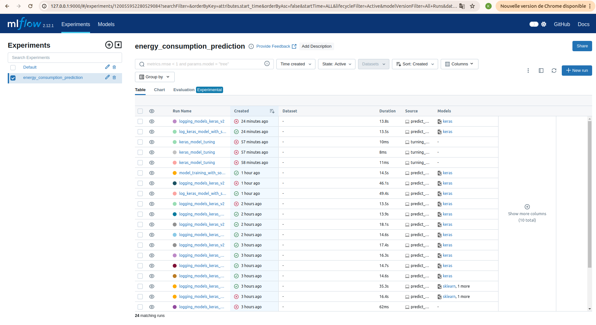
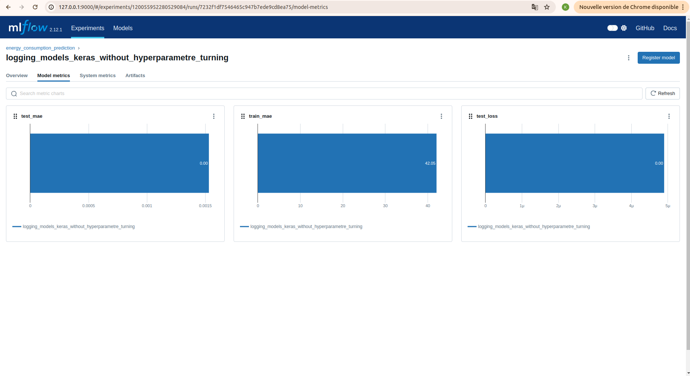
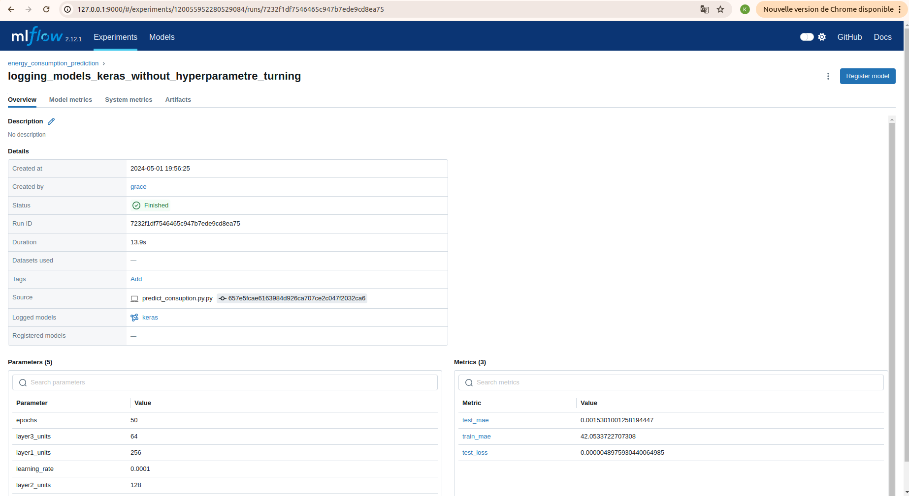
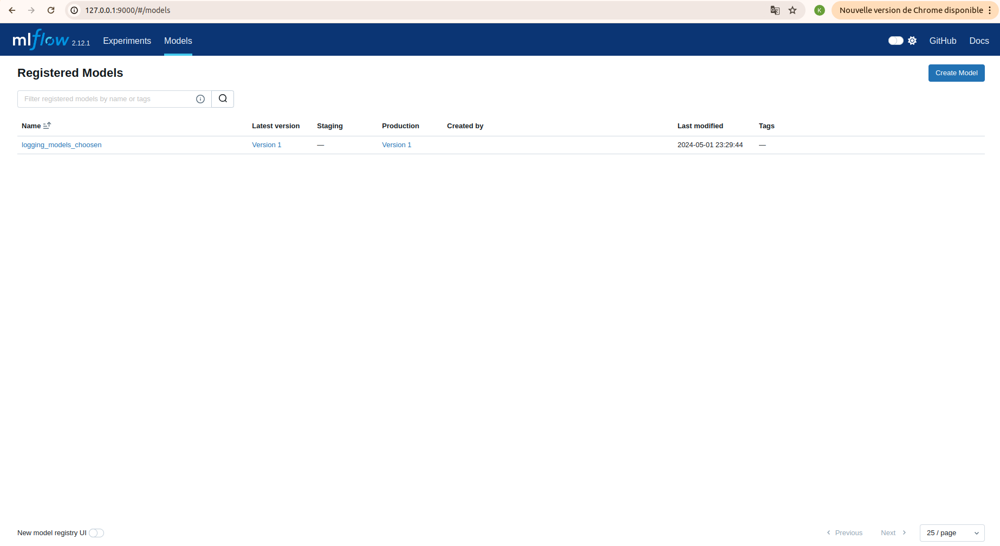
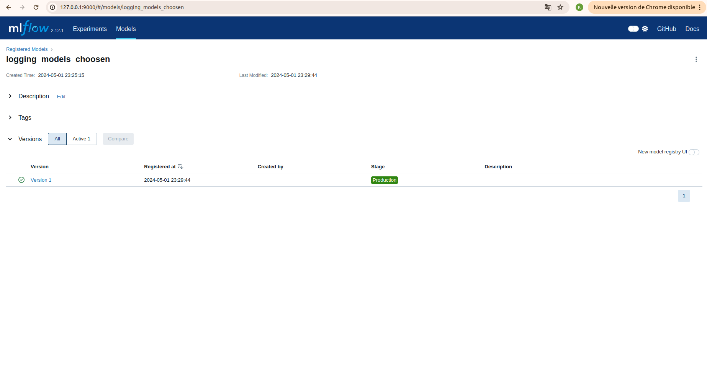
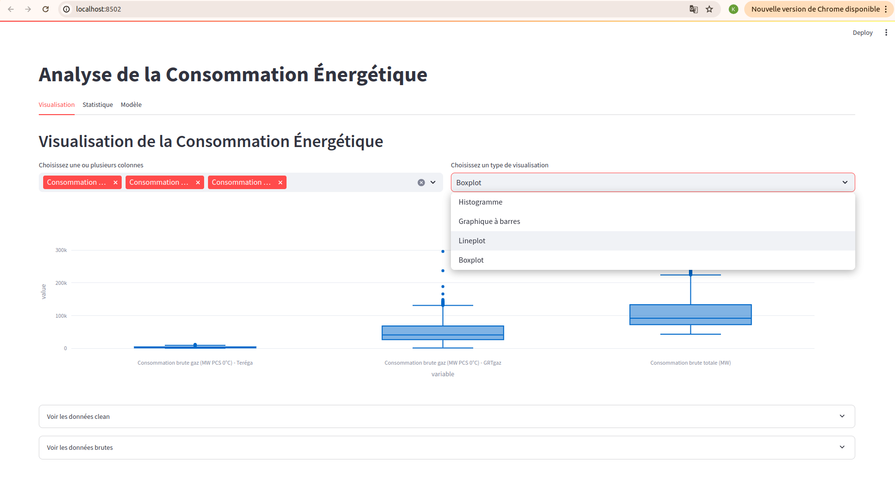
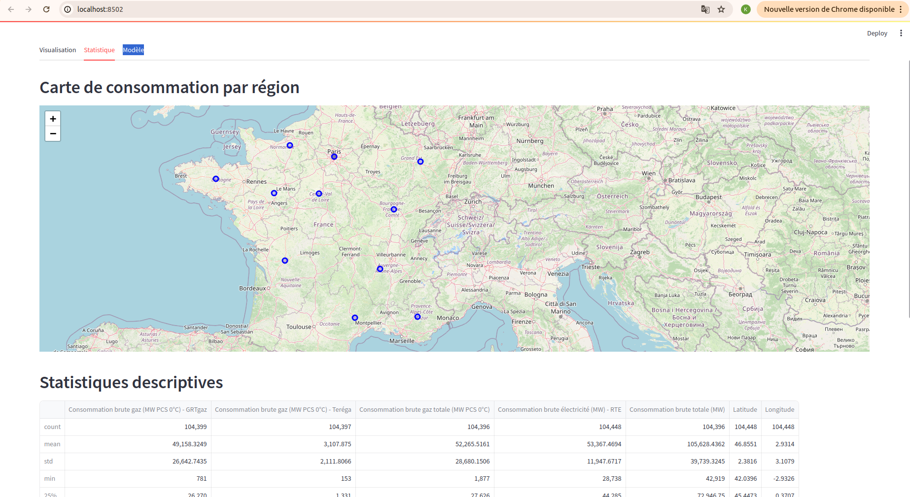
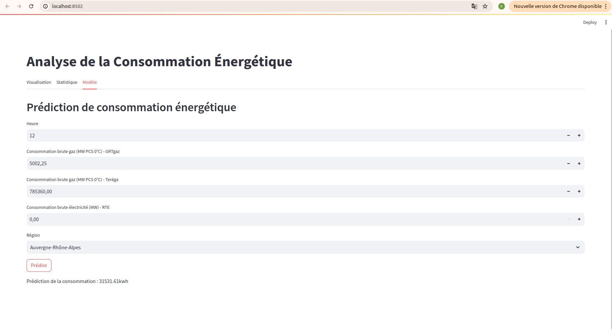

# ENERGY CONSUMPTION ANALYSIS

## Description

**Energy Consumption Analysis** est une application Streamlit conçue pour visualiser, analyser et prédire les données de consommation énergétique. Elle offre des outils pour explorer des données temporelles, réaliser des analyses statistiques et interactives, et intégrer des modèles prédictifs avancés.

## Fonctionnalités

- **Visualisation :** Utilisation de graphiques interactifs pour observer les tendances de consommation énergétique au fil du temps.
- **Analyse Statistique :** Fournit des analyses descriptives et exploratoires pour comprendre les données en profondeur.
- **Modélisation Prédictive :** Permet aux utilisateurs de former, évaluer et utiliser des modèles prédictifs pour estimer la consommation future basée sur les données historiques et les événements actuels comme les mouvements sociaux.

## Interfaces Utilisateur

### Interface MLflow

MLflow est utilisé pour le suivi des expériences et la gestion des modèles. Voici à quoi ressemble l'interface MLflow :







### Interface Streamlit

Streamlit permet aux utilisateurs de visualiser des données et d'interagir avec des modèles de machine learning en temps réel. Voici un aperçu de l'interface Streamlit :





## Technologies Utilisées

- **Python:** Langage de programmation principal.
- **Streamlit:** Pour la création de l'interface utilisateur.
- **TensorFlow/Keras:** Pour construire et entraîner des modèles de deep learning.
- **MLflow:** Pour le tracking des modèles et la gestion des expériences.
- **Docker:** Pour le déploiement et la gestion des conteneurs.

## Modèles Implémentés

- **Modèles de Deep Learning:** Utilisation de réseaux de neurones pour prédire la consommation énergétique. Les modèles ont été entraînés avec des caractéristiques telles que l'heure, la consommation brute de gaz et d'électricité, et la présence de mouvements sociaux.
- **Amélioration avec Hyperparameter Tuning:** Optimisation des modèles pour améliorer la précision des prédictions.

## Structure du Projet

```
energy-consumption-analysis/
│
├── dataset/                # Datasets utilisés pour l'analyse et la modélisation.
├── models/                 # Modèles entraînés et artefacts MLflow.
├── notebooks/              # Jupyter Notebooks pour l'exploration et l'analyse des données.
├── scripts/                # Scripts Python pour le traitement des données et l'entraînement des modèles.
├── app.py                  # Application Streamlit principale.
├── Dockerfile              # Pour construire l'image Docker du projet.
├── requirements.txt        # Dépendances nécessaires à installer.
└── README.md               # Documentation du projet.
```

## Modélisation Avancée et Résultats

### Aperçu des Modèles

Ce projet utilise des modèles de deep learning pour prédire la consommation énergétique basée sur des données historiques, incluant les heures de consommation, les consommations de gaz et d'électricité, ainsi que les impacts des mouvements sociaux. L'utilisation de TensorFlow et Keras a permis de développer des modèles robustes qui apprennent des patterns complexes dans les séries temporelles.

### Architecture des Modèles

Deux architectures principales de réseaux de neurones ont été testées et optimisées :

1. **Modèle de Base :**
   - **Couches :** Dense(256) -> Dense(128) -> Dense(64) -> Dense(1)
   - **Fonctions d'activation :** ReLU pour toutes les couches cachées.
   - **Optimisation :** Adam avec un taux d'apprentissage de 0.0001.
   - **Perte :** MSE (Mean Squared Error)
   - **Métrique :** MAE (Mean Absolute Error)

2. **Modèle avec Dropout :**
   - **Couches :** Ajout de couches Dropout à 20% après les deux premières couches denses pour réduire le surajustement.
   - **Configuration identique au modèle de base pour les autres paramètres.**

### Performance des Modèles

Les modèles ont été évalués sur la base de plusieurs métriques clés :
- **RMSE (Root Mean Squared Error) :** Mesure la différence moyenne entre les valeurs prédites et les valeurs réelles.
- **MAPE (Mean Absolute Percentage Error) :** Indique l'erreur en pourcentage, permettant une interprétation plus intuitive dans des contextes où les valeurs absolues varient grandement.

### Résultats Obtenus

Les résultats suivants ont été obtenus après l'entraînement des modèles sur les données nettoyées et préparées :

- **RMSE :** 108.13 pour le modèle de base, indiquant la précision générale des prédictions.
- **MAPE :** 0.0021 pour le modèle amélioré, démontrant une précision relativement élevée en pourcentage des valeurs prédites par rapport aux valeurs réelles.

### Tracking avec MLflow

MLflow a été utilisé pour suivre et documenter différentes expériences, y compris le suivi des hyperparamètres, des métriques et le stockage des modèles. Cela permet une reproductibilité et une analyse systématique des performances sur différentes configurations.

### Conclusion sur les Modèles

Les modèles avec dropout ont montré une réduction notable de l'overfitting, avec une amélioration des métriques sur les données de test. Les expériences indiquent que les ajustements d'hyperparamètres, notamment la taille des lots et le taux d'apprentissage, peuvent encore améliorer la précision des prédictions.

## Commencer

### Prérequis

- Python 3.10+
- Docker (pour le déploiement via conteneur)

### Installation

1. Clonez le dépôt :
   ```bash
   git clone git@github.com:keagnon/energy-consumption-analysis.git
   ```
2. Accédez au répertoire du projet :
   ```bash
   cd energy-consumption-analysis
   ```
3. Installez les dépendances :
   ```bash
   pip install -r requirements.txt
   ```

## Démarrage des Services

### Exécution Locale

Exécutez l'application via Mlflow :

```bash
mlflow ui
```
Exécutez l'application via Streamlit :

```bash
streamlit run app.py
```

## Déploiement avec Docker

Si vous avez déjà Docker installé et fonctionnel sur votre machine, vous pouvez déployer cette application en construisant et en exécutant un conteneur Docker. Suivez ces instructions :

1. Ouvrez un terminal et naviguez vers le répertoire racine du projet où se trouve le `Dockerfile`.

2. Construisez l'image Docker à l'aide de la commande suivante :
   ```bash
   docker build -t energy-consumption-analysis .
   ```
   Cette commande construit une image Docker nommée `energy-consumption-analysis` en utilisant le `Dockerfile` situé dans le répertoire courant (représenté par le `.`).

3. Une fois l'image construite, lancez un conteneur en utilisant :
   ```bash
   docker run -p 8501:8501 energy-consumption-analysis
   ```
   Cette commande exécute le conteneur Docker et mappe le port 8501 de votre machine au port 8501 du conteneur (ce qui est le port par défaut utilisé par Streamlit). Vous pouvez alors accéder à l'application Streamlit via votre navigateur en allant à l'adresse `http://localhost:8501`.

Assurez-vous de consulter le `Dockerfile` pour comprendre la configuration du conteneur et pour faire d'autres personnalisations si nécessaire.


## Licence

Distribué sous la Licence MIT. Voir `LICENSE` pour plus d'informations.

## Contact

- **Nom:** Grace GBE
- **LinkedIn:** [Grace GBE](https://www.linkedin.com/in/grace-gbe-306345206/)
